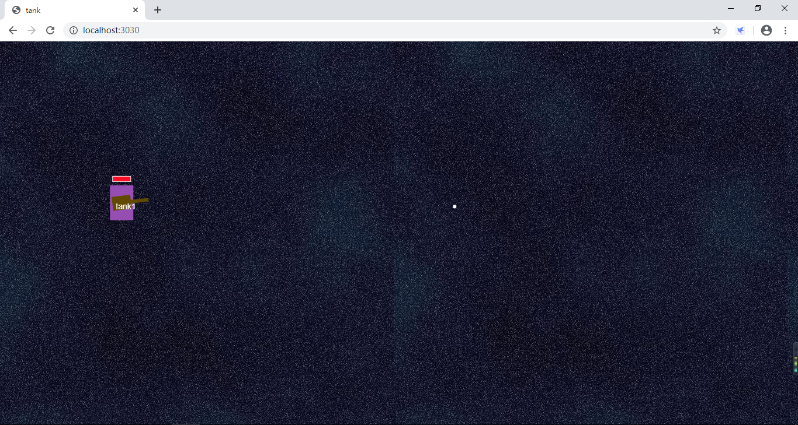

## tank
====

线上demo 
http://tank.leheavengame.com/


### 介绍

使用express和socket.io搭建的在线对战坦克小游戏。
前端部分使用canvas，并引入createjs第三方库。

## 项目截图


<div align=center>

</div>


``` bash
项目地址：（git clone）

git clone https://github.com/hujinbin/Vue-sell.git
 
 
# 通过npm安装本地服务第三方依赖模块(需要已安装Node.js)
npm install

本地运行
$ npm run dev


使用pm2在服务端运行
$ npm run server


```
